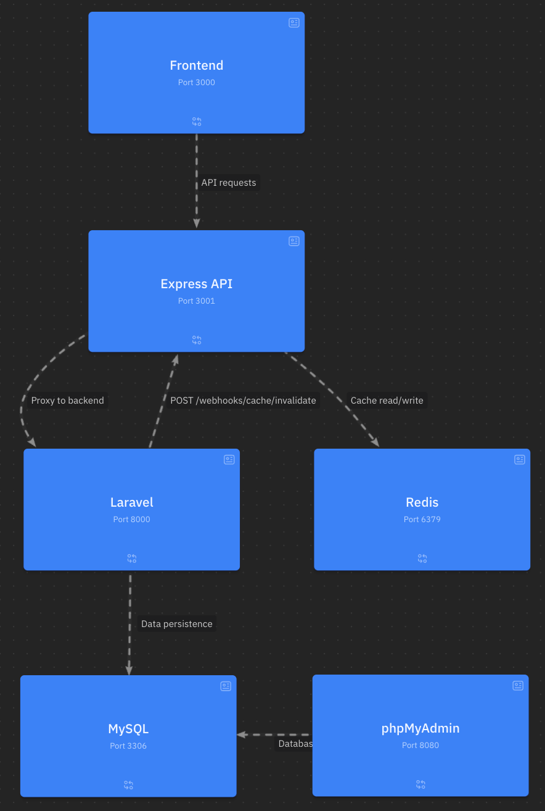
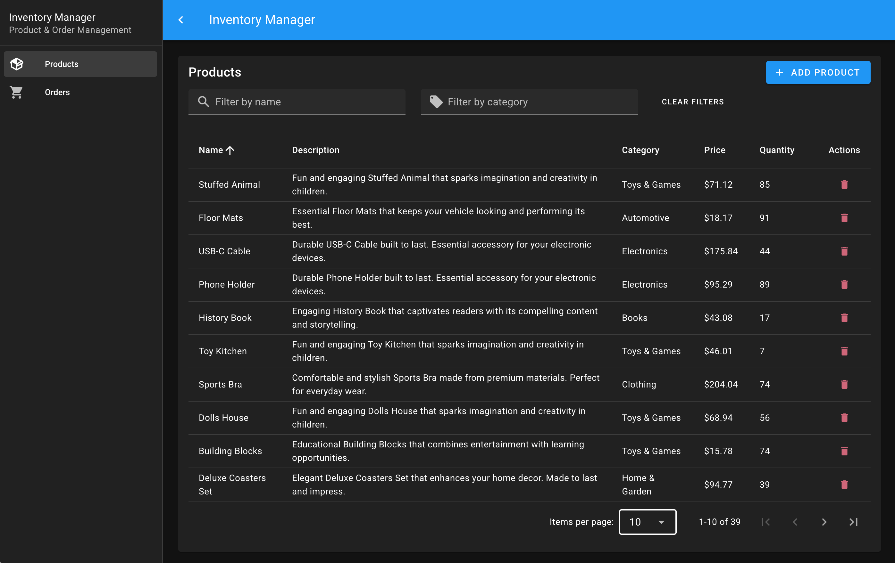
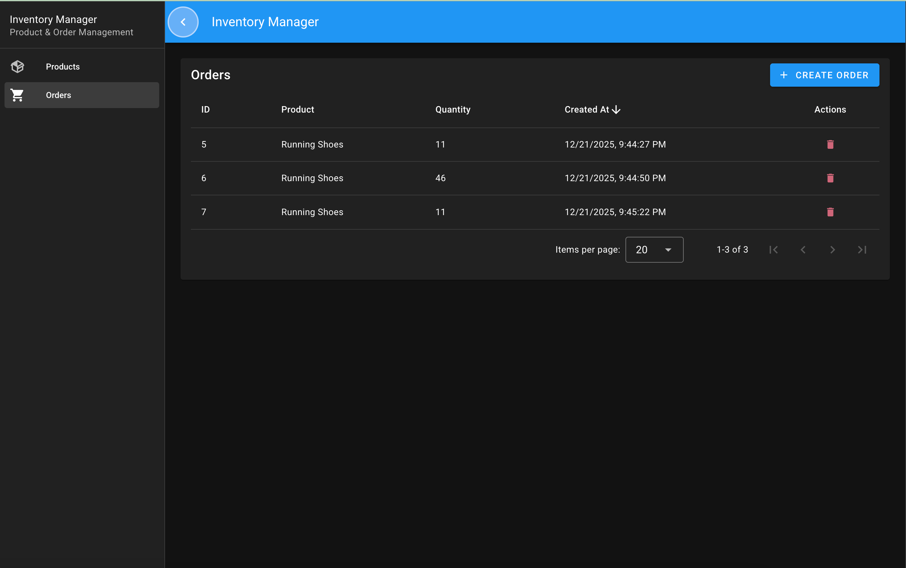
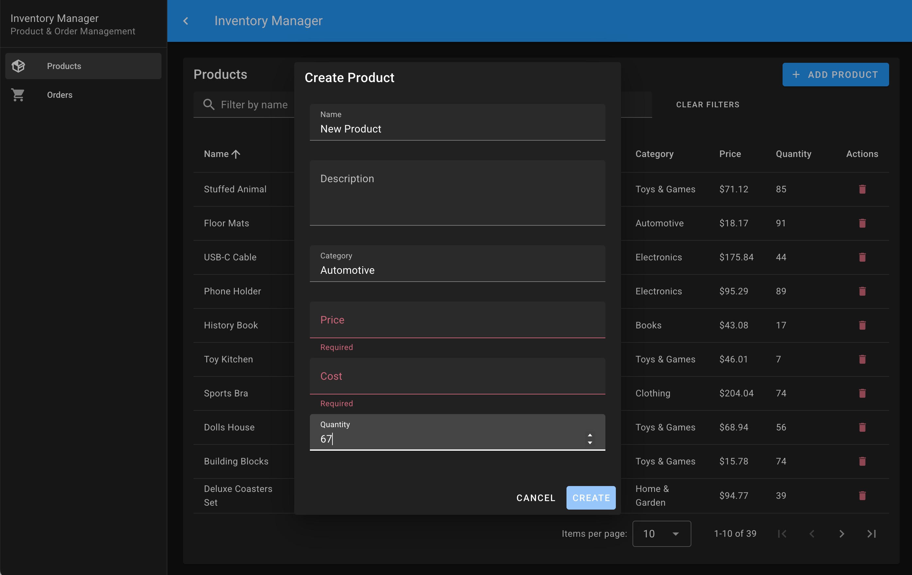

# Inventory Manager

A full-stack inventory management system with a modern microservices architecture.


## Overview

Inventory Manager is a web application for managing products and orders. It demonstrates a multi-tier architecture with clear separation of concerns:

- **Frontend** - Vue 3 SPA with Vuetify Material Design components
- **API Gateway** - Express.js service with Redis caching
- **Backend** - Laravel REST API with MySQL persistence

### Features

- Product management (CRUD operations with pagination and filtering)
- Order management with stock validation
- Redis caching with automatic invalidation via webhooks
- Server-side pagination for large datasets
- Responsive Material Design UI

## Architecture



| Service | Port | Description |
|---------|------|-------------|
| Frontend | 3000 | Vue 3 + Vuetify SPA |
| Express API | 3001 | API Gateway with Redis caching |
| Laravel API | 8000 | Backend REST API |
| MySQL | 3306 | Data persistence |
| Redis | 6379 | Cache layer |
| phpMyAdmin | 8080 | Database administration |

### Data Flow

1. Frontend makes requests to Express API Gateway
2. Express checks Redis cache for GET requests
3. On cache miss, Express proxies to Laravel
4. Laravel queries MySQL and returns data
5. Express caches response and strips sensitive fields (e.g., `cost`)
6. On data mutations, Laravel sends webhook to invalidate cache

## Screenshots

### Products Page


### Orders Page


### Create Product


## Tech Stack

| Layer | Technologies |
|-------|--------------|
| Frontend | Vue 3, Vuetify 3, Pinia, Vue Router, Vite |
| API Gateway | Express 5, TypeScript, ioredis, Joi, Axios |
| Backend | Laravel 12, Eloquent ORM, PHP 8.2 |
| Database | MySQL 8.0 |
| Cache | Redis 7.0 |
| Infrastructure | Docker, Docker Compose |

## Getting Started

### Prerequisites

- Docker and Docker Compose installed
- Ports 3000, 3001, 3306, 6379, 8000, 8080 available

### Quick Start

```bash
# Clone the repository
git clone <repository-url>
cd path/to/repo

# Start all services
docker-compose up --build

# Wait for all services to initialize (~30 seconds)
```

### Access Points

| Service | URL |
|---------|-----|
| Frontend | http://localhost:3000 |
| Express API | http://localhost:3001 |
| Laravel API | http://localhost:8000/api/v1 |
| phpMyAdmin | http://localhost:8080 |

### Database Credentials

| Field | Value |
|-------|-------|
| Host | localhost:3306 |
| Database | laravel |
| Username | admin |
| Password | qwertyui |

### Test User Credentials

Run the seeder to create a test user:

```bash
docker compose exec laravel php artisan db:seed
```

| Field | Value |
|-------|-------|
| Email | admin@example.com |
| Password | password123 |

Auth endpoint: `POST /api/v1/auth/validate`

## Project Structure

```
├── frontend/                   # Vue 3 + Vuetify
│   └── src/
│       ├── modules/           # Feature modules
│       │   ├── products/      # Products feature
│       │   └── orders/        # Orders feature
│       ├── shared/            # Shared utilities
│       ├── pages/             # Page components
│       └── layouts/           # Layout components
│
├── express-api/               # Express API Gateway
│   └── src/
│       ├── modules/           # Feature modules
│       │   ├── products/      # Products endpoints
│       │   ├── orders/        # Orders endpoints
│       │   └── cache/         # Webhook handlers
│       ├── common/            # Shared utilities
│       └── config/            # Configuration
│
├── laravel-app/               # Laravel Backend
│   └── src/
│       ├── app/
│       │   ├── Http/          # Controllers, Requests
│       │   ├── Models/        # Eloquent models
│       │   └── Observers/     # Model observers
│       ├── database/          # Migrations, seeders
│       └── routes/            # API routes
│
├── docs/                      # Documentation assets
└── docker-compose.yml         # Service orchestration
```

## API Endpoints

### Express Gateway (Port 3001)

| Method | Endpoint | Description |
|--------|----------|-------------|
| GET | `/products` | List products (paginated, cached) |
| GET | `/products/:id` | Get single product |
| POST | `/products` | Create product |
| PUT | `/products/:id` | Update product |
| DELETE | `/products/:id` | Delete product |
| GET | `/orders` | List orders (paginated) |
| POST | `/orders` | Create order |
| DELETE | `/orders/:id` | Delete order |
| POST | `/webhooks/cache/invalidate` | Invalidate product cache |

### Query Parameters

**Products:**
- `page` - Page number (default: 1)
- `per_page` - Items per page (default: 20, max: 100)
- `name` - Filter by name (partial match)
- `category` - Filter by category (partial match)

**Orders:**
- `page` - Page number (default: 1)
- `per_page` - Items per page (default: 20, max: 100)

## Development

### Running Tests

The project includes comprehensive testing across all layers:

| Layer | Framework | Command |
|-------|-----------|---------|
| Express API | Vitest + Supertest | `cd express-api/src && npm test` |
| Laravel | Pest | `docker exec laravel_app php artisan test` |
| Vue Frontend | Vitest + Vue Test Utils | `cd frontend && npm test` |
| E2E | Playwright | `npm run test:e2e` |

```bash
# Express API unit & integration tests
cd express-api/src && npm test
cd express-api/src && npm run test:coverage  # with coverage

# Laravel tests (via Docker)
docker exec laravel_app php artisan test
docker exec laravel_app php artisan test --coverage  # with coverage

# Vue frontend unit tests
cd frontend && npm test
cd frontend && npm run test:coverage  # with coverage

# E2E tests (requires all services running)
docker-compose up -d
npm run test:e2e          # headless
npm run test:e2e:headed   # with browser visible
npm run test:e2e:ui       # Playwright UI mode
```

### Test Structure

```
├── express-api/src/
│   └── tests/
│       ├── setup.ts              # Test setup & mocks
│       ├── unit/                 # Unit tests
│       │   └── jwt.test.ts
│       └── integration/          # API integration tests
│           └── auth.test.ts
│
├── laravel-app/src/tests/
│   ├── Feature/                  # Feature tests
│   │   ├── AuthTest.php
│   │   ├── ProductTest.php
│   │   └── OrderTest.php
│   └── Unit/                     # Unit tests
│
├── frontend/tests/
│   ├── setup.js                  # Test setup & mocks
│   └── unit/                     # Composable tests
│       ├── useAuth.test.js
│       └── useCrud.test.js
│
└── e2e/
    ├── fixtures/                 # Test fixtures
    │   └── auth.ts
    └── tests/                    # E2E specs
        ├── auth.spec.ts
        └── products.spec.ts
```

### Environment Variables

**Express API:**
| Variable | Default | Description |
|----------|---------|-------------|
| NODE_ENV | development | Environment mode |
| REDIS_HOST | redis | Redis hostname |
| REDIS_PORT | 6379 | Redis port |
| LARAVEL_API_URL | http://laravel-app:8000/api/v1 | Laravel API URL |
| CACHE_TTL | 300 | Cache TTL in seconds |

**Laravel:**
| Variable | Default | Description |
|----------|---------|-------------|
| DB_HOST | laravel-db | MySQL hostname |
| DB_DATABASE | laravel | Database name |
| DB_USERNAME | admin | Database user |
| DB_PASSWORD | qwertyui | Database password |
| EXPRESS_API_URL | http://express-api:3001 | Express API URL |

## License

MIT
